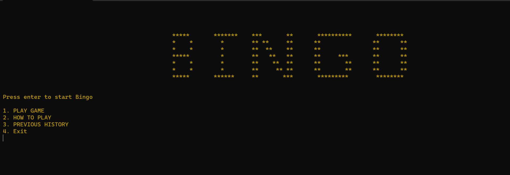
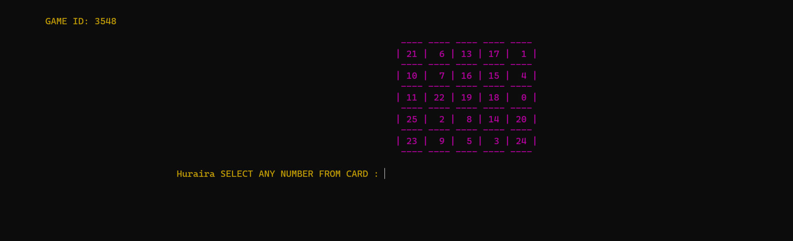

# BINGO 

The Game is coded in C++ programming language is excellent for new C++ devolpers. The game features use of functions  , input handling using string and basic file handling.

# Sample Screentshots
## Main screen screenshots

## Game Play

# To Run game
1.Download the project as zip.  
2.Open the .sln file in folder PF-Bingo.  
3.Run the code   
4.Enjoy the classical game!!

# Authors
This game is devopled in C++ by Huraira and Humail as Semester Project.
